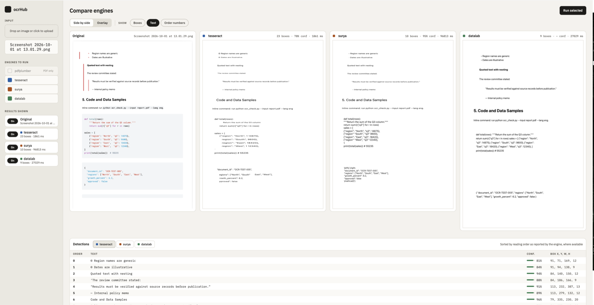
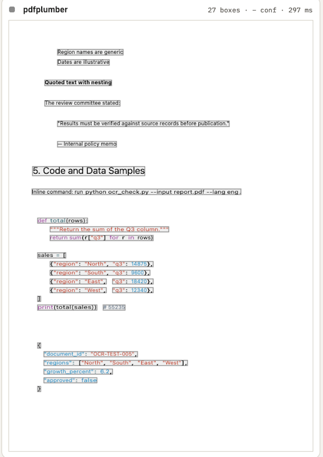
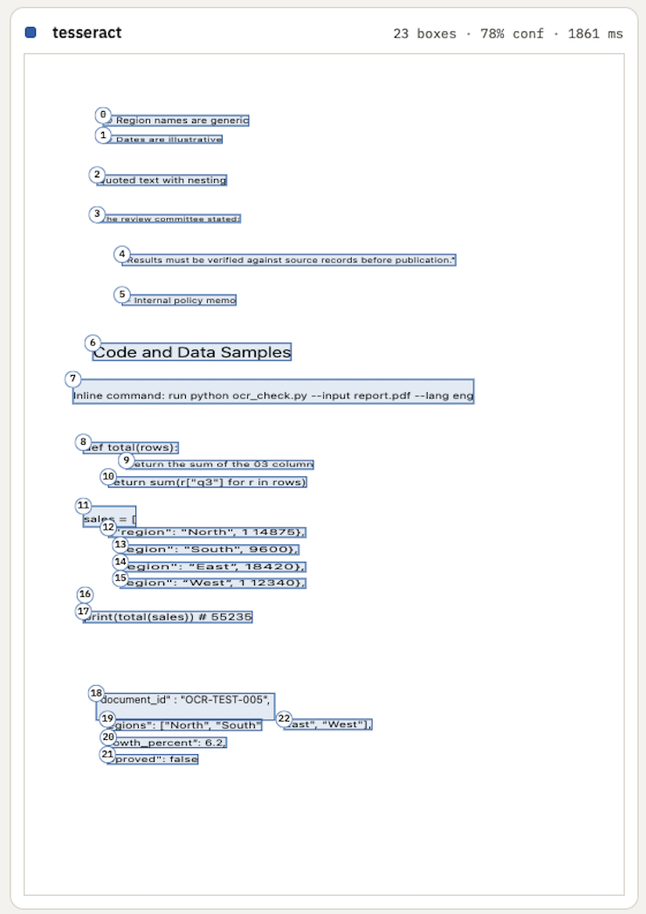
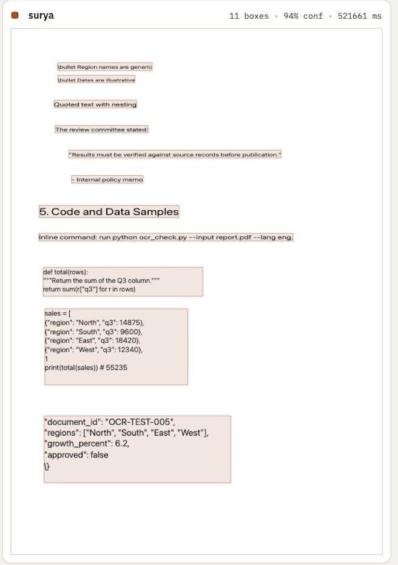
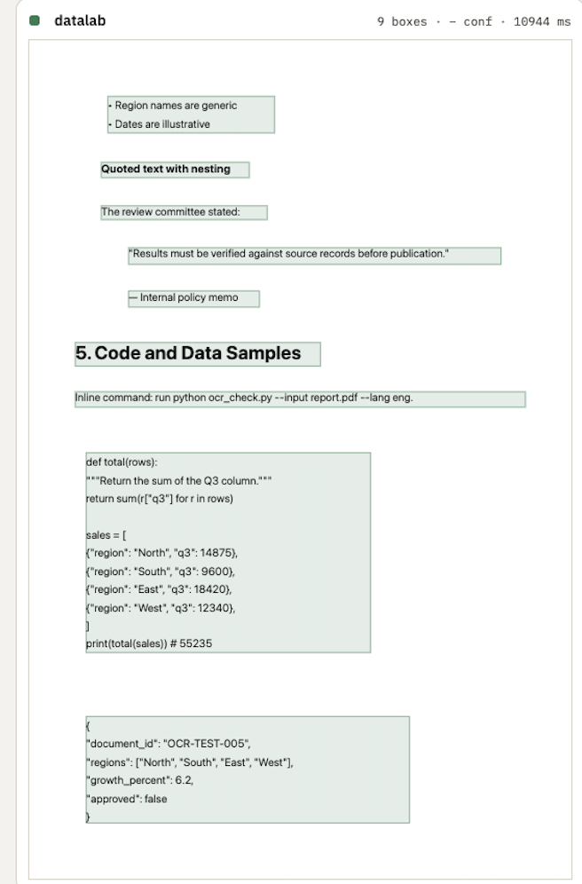
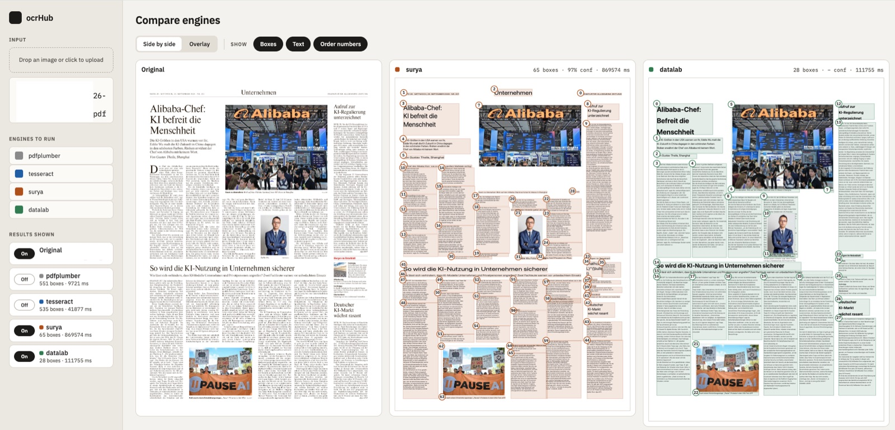

# How the dashboard visualises each OCR engine

The dashboard at <http://localhost:8000> runs the engines you tick on one
file and shows their results side by side. Every engine returns the same
shape (`OcrResult` > pages > boxes, see `src/ocrhub/models.py`), but they
return very different amounts of detail. The dashboard draws whatever each
engine actually provides and does not invent the rest. This page describes
what each engine gives you, how it is drawn, and where it falls short.

## Contents

1. [The dashboard](#the-dashboard)
2. [What each engine returns](#what-each-engine-returns)
3. [pdfplumber](#pdfplumber)
4. [Tesseract](#tesseract)
5. [Surya](#surya)
6. [Datalab](#datalab)
7. [Behaviour shared by all engines](#behaviour-shared-by-all-engines)
8. [Demo files](#demo-files)
9. [Versions](#versions)
10. [Known limitations and untested parts](#known-limitations-and-untested-parts)

## The dashboard

*Side by side on a PNG of part of the test PDF, with **Text** on. Tesseract
took 1.9 s, Datalab 27 s and Surya 97 s. Surya's panel shows its raw output:
LaTeX fragments such as `\left(` around the JSON braces.*

- **Sidebar:** upload a file, tick the engines to run, and choose which
  finished results are shown.
- **Side by side:** one panel per engine, plus the original. Each panel
  draws that engine's boxes on the page.
- **Overlay:** all engines' boxes drawn on top of one page image, each in
  its own colour (tesseract blue, surya orange, datalab green, pdfplumber
  grey). The image used is the first engine's page image;
  boxes from engines that measured a different image size are rescaled to it.
- **Show toggles:** *Boxes* (outlines), *Text* (the recognised text drawn at
  the box position) and *Order numbers* (reading-order badges).
- **Detections table:** one tab per engine, listing order, text,
  confidence and box (x, y, w, h), sorted by the reading order the engine
  reported where there is one. Engines with no boxes fall back to their
  text lines.

Each ticked engine is sent as its own request, so a fast engine such as
pdfplumber appears immediately while Surya is still running.

## What each engine returns

| | pdfplumber | Tesseract | Surya | Datalab |
|---|---|---|---|---|
| Input | PDF only (text layer) | image or PDF | image or PDF | image or PDF |
| Is it OCR? | no, reads the PDF's text layer | yes | yes | yes (hosted API) |
| Box granularity | text line (split at column gaps) | line, with words nested | layout region (lines with `SURYA_LAYOUT=0`) | layout block (paragraph, list, table, heading...) |
| Reading order | yes, but geometric (top to bottom, left to right) | yes, from Tesseract's block/paragraph/line numbers | yes, from its layout model | yes, from the engine |
| Confidence | no | per word, per line, per page | per region (mean of its lines), per page | no |
| Region types | Text, Table, Picture | none | Title, Text, Table, Picture, Header, Footer, Caption, Equation, Code... | Title, Text, Table, Figure/Picture, Caption, Header, Footer |
| Fonts and colours | yes: font, size, bold, italic, colour, per run | no | no | no (sizes are estimated, see below) |
| Tables | real tables with cell alignment | no | yes, as html (table model) | yes, as html |
| Pictures | cropped image | no | cropped image | cropped image plus alt text |
| Original markup kept | no | no | no | yes: `html` per box and the untouched `raw` response |
| Page image in result | no | yes | yes | no |
| Coordinates | PDF points (about 595 wide for A4) | pixels | pixels | pixels (about 1600 wide in our tests) |

The coordinate differences matter for visualisation: the same page has
different box numbers for each engine, so the dashboard sizes order badges
and fonts from each page's own coordinate space.

## pdfplumber

pdfplumber does not recognise anything. It reads the characters already
embedded in a born-digital PDF, so it is fast (under a second) and exact,
and it is the reference the other engines can be compared against.
Code: `src/ocrhub/adapters/pdfplumber_adapter.py`.

*pdfplumber on the born-digital PDF (27 boxes, 0.3 s) with **Boxes** and
**Text** on. Each run keeps its own colour, so the code's syntax highlighting
survives.*

**What the dashboard shows**

- **Real fonts, sizes and colours.** Each line is split into *runs* of one
  style (for example a bold `Date:` followed by regular text). Each run is
  drawn at its own x position with the PDF's real font size, weight, italic
  and colour. The browser's font is not the PDF's, so each run is stretched
  to the run's measured width (`textLength`). Hovering a run shows
  `font size`.
- **Tables.** `find_tables()` locates tables; each becomes one `Table` box
  with `html` built from the cells. Characters are assigned to cells by
  their centre point, because table row edges do not always enclose their
  text. Cell alignment (left, centre, right) is inferred from the gaps
  inside the cell, and mostly bold cells are rendered bold. Lines inside a
  table are not repeated as separate text boxes.
- **Column splitting.** pdfplumber joins the columns of a multi-column page
  into one very wide line. A gap wider than 1em between glyphs is treated as
  a column gutter, so each column becomes its own box.
- **Pictures.** Embedded images are cropped from the page at 96 dpi and
  drawn in place.
- **Invisible text.** Characters under 1pt and braille-blank padding
  characters are dropped, and so are glyphs positioned off the page.

**Quirks**

- The reading order is a sort by position (top, then left), not the PDF's
  internal content order. On a two-column page the order badges therefore
  run across the columns, not down each one.
- No page image and no confidence. For a PDF, the Original panel borrows a
  page image from another engine that ran (for example Tesseract); with
  pdfplumber alone it draws on a blank page sized to the PDF.
- Scanned PDFs have no text layer, so pdfplumber returns nothing useful.

## Tesseract

The classic baseline. Code: `src/ocrhub/adapters/tesseract_adapter.py`.

*Tesseract on an image of the page (23 boxes, 78% confidence, 1.9 s) with
**Boxes**, **Text** and **Order numbers** on. Reading order is one number per
line, and misreads are visible, for example "03" for "Q3".*

**What the dashboard shows**

- **One box per line**, built from Tesseract's word-level data. Words that
  share a block, paragraph and line number are grouped. The words stay
  nested inside the box, each with its own box and confidence.
- **Reading order** is the order Tesseract reported the lines in.
- **Confidence.** Each line's confidence is the mean of its word
  confidences, and the page confidence is the mean over all words. Words
  with confidence -1 (no value) are ignored.
- The page image is returned with the result (PDFs are rasterised first),
  so Tesseract is the usual source of the background image in the Overlay
  view and the Original panel.
- The text is drawn in place at the line's position, scaled to fit the box.

**Quirks**

- No region types, so headings, tables and lists are not distinguished:
  everything is a line of text.
- It does not handle multi-column layouts or photos as well as the
  layout-aware engines, and its order follows its own block detection.

## Surya

Surya is a set of models. The adapter runs four of them in sequence:
detection and recognition (text lines and their text), then layout (labelled
regions and a reading order) and table recognition (rows, columns and cells).
Code: `src/ocrhub/adapters/surya_adapter.py`.

*Surya on the same page (11 boxes, 94% confidence) with **Boxes** and
**Text** on. The code lines are grouped into regions, and the list markers
come out as `\bullet`.*

**What the dashboard shows**

- **One box per layout region**, in the layout model's reading order, with a
  region type (Title, Text, Table, Picture, Header, Footer, Caption, ...)
  and a confidence (the mean of the lines inside the region, 0-100). Each
  line of recognised text is placed in the smallest region around its centre.
  Labels Surya has but Datalab does not (Equation, Code, Form,
  TableOfContents, Handwriting) keep Surya's own name.
- **Tables as html.** The table model finds each Table region's cells,
  including header cells and row and column spans. The adapter fills the
  cells with the recognised lines that fall inside them.
- **Pictures.** Picture and Figure regions are cropped from the page and
  drawn like Datalab's.
- **Lines outside every region** are kept as plain boxes with no region type
  or reading order, so no recognised text is lost.
- Recognised text can contain inline markup; it is stripped to plain text.
- **Staged models.** The models run one after another and each is released
  before the next loads, to keep memory down. The layout and table models
  download on first use (the first run is slower).
- **`SURYA_LAYOUT=0`** skips the layout and table models and returns one
  box per line with no order or region types, which needs less time and memory.
  If the layout step fails (for example a model download), the adapter logs a
  warning and returns the lines instead of losing the OCR work.

**Quirks**

- **Maths output.** Surya sometimes outputs LaTeX in place of the characters
  it sees: `\triangle` for a warning icon, and `\bullet` at the start of list
  items, which show up in the text.
- **Page confidence scale.** Region confidences are shown 0-100, but the page
  confidence in the saved JSON is the unscaled 0-1 mean over lines.
- **List markers come out as LaTeX or odd glyphs.** Bullets, checkboxes and
  warning icons are recognised as `\bullet`, `\prec`, `\blacktriangledown`
  or sometimes a stray character (`۰` once), kept in front of the item's text
  on the same line. Code regions can end in `\}` and table cells can carry
  `{\tt ...}` markup. These are Surya's raw output and are not cleaned up.
- **Reading order is per region, not per line.** Order badges number the
  blocks, not the lines inside them.
- **Cost of layout and tables.** On a Docker Desktop Mac, the 2-page
  `ocrdoc.pdf` took about 195 s and the receipt photo about 195 s with layout
  on, and the container peaked at about 6.1 GiB (it was about 5.6 GiB with
  lines only), with no OOM kill. The first run also downloads the layout and
  table models. The 4-page `OCR Test Document.pdf` took about 520 s (8.7
  min).
- **Receipts are one or a few big regions.** The layout model grouped the
  receipt photo's 29 lines into 3 regions (header, items, footer), so the
  block view is much coarser than Tesseract's lines there. All text is kept.

## Datalab

A hosted document-conversion API that returns a tree of layout blocks.
Code: `src/ocrhub/adapters/datalab_adapter.py`.

*Datalab on the same page (9 boxes, 11 s) with **Boxes** and **Text** on. Each
list, heading and code block is one block, with the bullets drawn from its
html.*

**What the dashboard shows**

- **One box per block**, in the reading order Datalab gives. The `Page`
  wrapper is skipped, and each block's type is mapped to a region type:
  `SectionHeader` -> Title, `Table`, `Caption`, `PageHeader` -> Header,
  `PageFooter` -> Footer, `ListGroup`/`ListItem`/`Footnote`/`Text` -> Text.
- **Markup is rendered, not flattened.** Each box keeps its original `html`,
  so lists, tables and bullets are drawn with their structure. The html goes
  through an allowlist sanitiser that rebuilds only known tags and drops
  every attribute except table spans. The plain `text` field is built from
  the html with bullets and numbers restored and one line per table row; a
  bullet is not added twice when Datalab already put one in the item text.
- **Font sizes come from box geometry.** Datalab gives no font information,
  so the size is estimated from the box: a single line is about 1.1x the
  font size tall, and each extra wrapped line adds about 1.75x (font plus
  leading). The estimate solves that for the largest font whose wrapped
  text fits the box. Tables use the page's body size (the median over its
  plain text blocks) because table boxes are padded and say nothing about
  their font, and estimates within about 30% of body size are snapped to it,
  since they are measurement noise.
- **Pictures** are drawn from the cropped image Datalab extracted, with its
  alt text or caption as the hover title.
- **Saved extras.** The result keeps the untouched block tree in `raw` for
  anyone using `data/output/<hash>/datalab.json` directly. It is not sent
  to the dashboard.

**Quirks**

- Datalab reports no page image or page size, so the dashboard draws on a
  blank page sized to the boxes' extent.
- Datalab itself returned "Important Notice" as the fourth item of a list
  on one document, as a list item and not a heading. That came from Datalab,
  not from the dashboard's rendering.
- It is a paid hosted service (free monthly tier), and takes 10 s to
  2.5 min in our tests depending on its queue.

## Behaviour shared by all engines

- **Order badges** are sized from the page's coordinate space
  (`max(15, 3% of page width)`), so they stay legible on a 595-point PDF and
  a 1600-pixel image alike. They are shown only for boxes that have a
  reading order, which is why Surya has none when `SURYA_LAYOUT=0`.
- **Draw priority inside a box** (`drawBoxes` in `web/static/app.js`):
  Picture image, else rendered html (Datalab), else styled runs
  (pdfplumber), else plain text fitted to the box (Tesseract, Surya).
- **Image normalisation.** Uploads are normalised before any engine sees
  them: EXIF rotation applied (phone photos are stored sideways), flattened
  to RGB, longest side capped at 3000 px, re-encoded as PNG. This fixed
  iPhone MPO photos and sideways pages. The original stays untouched in
  `data/input`. HEIC is not supported yet; export to JPEG first.
- **Results are cached on disk.** Each result is saved to
  `data/output/<hash>/<engine>.json`, keyed by the SHA-256 of the file, and
  the dashboard shows the cached result when it exists. After changing an
  adapter, **old files keep showing the old behaviour**. Delete
  `data/output/<hash>/<engine>.json` or send `refresh=true` on `/ocr`. The
  dashboard has no refresh button yet.
- **Errors are per engine.** A failing or missing engine shows its own
  error and the others still render.

## Demo files

Files used to try the dashboard (kept in `data/input`):

| File | What it shows |
|---|---|
| Born-digital PDF | pdfplumber at its best: exact text, fonts, colours, tables, columns, pictures; a reference for the OCR engines |
| Receipt photo (iPhone JPEG) | Image normalisation (rotation, MPO); a hard case for Tesseract and Surya (Surya returns 3 regions for it); Datalab's output on it was a mess and has not been reviewed |
| German newspaper PDF | Dense multi-column layout; column splitting in pdfplumber; Surya took about 14.5 min of compute here with layout on (more by the clock if the machine sleeps) |

*A dense newspaper page, shown at low resolution only to illustrate layout
(all rights remain with the publisher). With **Boxes** and **Order numbers** on,
Surya (65 boxes, 97% confidence) cuts the page into many small text regions,
while Datalab (28 boxes) uses fewer, larger blocks. Each engine numbers its
own regions in its own reading order, so the same article is split and ordered
differently.*

A 4-page test document with nested lists, a task list, callouts, code samples
and tables is also used, and shows how each engine handles list structure.

## Versions

Everything above describes the versions this image actually installs. Release
dates are from PyPI, checked on 2026-10-01.

| Component | Used | Latest | Why this version |
|---|---|---|---|
| surya-ocr | 0.14.7 (2025-07-25), pinned | 0.22.1 (2026-07-20) | The 0.20+ line (0.20.0 is 2026-05-27) rewrote recognition around a VLM backend that needs an external llama-server or a GPU, with a different call signature and no per-line confidence. 0.14.7 is the version verified against this adapter. 0.15.0 to 0.17.1 (2025-08 to 2026-01) were not individually tested. |
| numpy | below 2, pinned | | Kept from the environment this was verified in. It was first needed for PaddleOCR, which has been removed. |
| Python | 3.11 (`python:3.11-slim`) | | The project requires 3.11 or newer. Surya allows 3.10 or newer. Newer Pythons were not tested with the pinned engines. |
| Tesseract | 5.5.0 | | Installed from Debian by `apt` in the Dockerfile, so the version follows the base image. |
| pytesseract | 0.3.13 (2024-08-16) | 0.3.13 | Not pinned, and already the latest. |
| pdfplumber | 0.11.9 (2026-01-05) | 0.11.10 (2026-06-15) | Not pinned (0.11 or newer), so a rebuild can pick up newer releases. |
| torch, transformers | 2.14.0, 4.53.3 | | Not pinned by us. They are whatever Surya's pinned release resolved to at build time. |

**What upgrading Surya would change.** Moving to the 0.20+ line is not a
version bump. The recognition call changes, per-line confidence goes away
(so the confidence column and bars would be empty for Surya), and the layout
and table code in `surya_adapter.py` was written against the 0.14.7 API and
would need rechecking. Within the 0.1x line, 0.15.0 to 0.17.1 keep the
same recognition call and result shapes, but 0.15.0 and later build the
recogniser on a new `FoundationPredictor`, which the adapter would have to
create and pass in, and they download newer recognition models (and, from
0.17.x, a newer layout model). 0.16 and later also need `transformers`
4.56.1 or newer. A reasonable first experiment would be 0.17.1, but it has not
been tried.

## Known limitations and untested parts

- **Not tested:** the Overlay view.
- **Removed engines:** PaddleOCR and the Ollama (DeepSeek) engine were
  removed before the first release because they had never been tested here.
  They remain in the git history before the removal commit.
- **HEIC** uploads are unsupported.
- **No refresh button** in the UI to bypass the cache.
- **Surya:** emits LaTeX such as `\triangle` and `\bullet`.
- **Datalab on the receipt photo** needs a look.
- Reading order comes from all four engines, though pdfplumber's is
  geometric and Surya's needs the layout step (`SURYA_LAYOUT` on).
